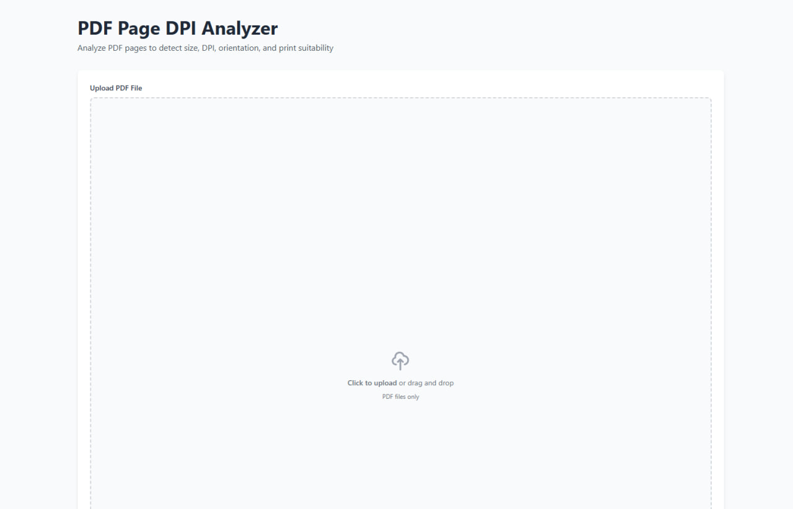
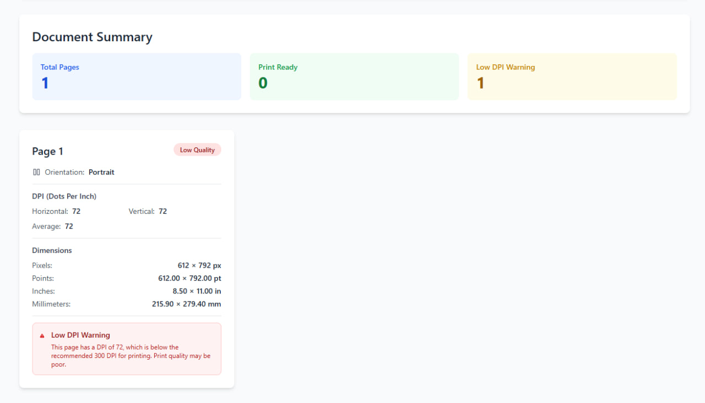

# PDF Page DPI Analyzer

A browser-based tool that analyzes PDF files to detect page size, DPI, orientation, and print suitability. Built with pdf.js and Tailwind CSS.





## Features

- 📄 **PDF Analysis**: Load and analyze any PDF file directly in your browser
- 📏 **Multiple Units**: Display page dimensions in pixels, points, inches, and millimeters
- 🎯 **DPI Detection**: Calculate horizontal, vertical, and average DPI for each page
- 🔄 **Orientation Detection**: Automatically detect Portrait, Landscape, or Square orientation
- ⚠️ **Print Warnings**: Get warnings for pages with low DPI (< 300 DPI for printing)
- ✅ **Quality Indicators**: Visual indicators for high-quality (600+ DPI), print-ready, and low-quality pages
- 🎨 **Clean UI**: Modern, responsive interface built with Tailwind CSS
- 📊 **Summary Statistics**: Quick overview of total pages, print-ready pages, and low DPI warnings

## Usage

1. Open `index.html` in a modern web browser (Chrome, Firefox, Safari, Edge)
2. Click the upload area or drag and drop a PDF file
3. View the analysis results for each page

### Local Development

Simply open the `index.html` file in your browser - no build process required!

```bash
# Clone the repository
git clone https://github.com/BaseMax/pdf-page-dpi-analyzer.git
cd pdf-page-dpi-analyzer

# Open in browser
open index.html  # macOS
# or
start index.html  # Windows
# or
xdg-open index.html  # Linux
```

**Note:** This tool requires an internet connection to load the pdf.js library from CDN. Make sure you're online when you open the page.

### Using a Local Server (Optional)

For better development experience, you can use a local server:

```bash
# Python 3
python -m http.server 8000

# Node.js
npx http-server

# Then open http://localhost:8000 in your browser
```

## How It Works

The tool uses pdf.js to:
1. Load and parse PDF files in the browser
2. Extract page dimensions in PDF points (1 point = 1/72 inch)
3. Convert dimensions to multiple units (mm, inches, pixels)
4. Calculate DPI based on page dimensions
5. Determine page orientation
6. Assess print suitability based on DPI thresholds

### DPI Thresholds

- **Low Quality** (< 300 DPI): Not recommended for printing
- **Print Ready** (300-599 DPI): Minimum acceptable quality for printing
- **High Quality** (600+ DPI): Recommended for professional printing

## Technologies Used

- [pdf.js](https://mozilla.github.io/pdf.js/) - PDF rendering and parsing
- [Tailwind CSS](https://tailwindcss.com/) - Styling and UI components
- Vanilla JavaScript - No framework dependencies

## Browser Compatibility

Works in all modern browsers that support:
- File API
- ArrayBuffer
- Async/Await
- ES6+ JavaScript

## License

MIT License - see LICENSE file for details

## Contributing

Contributions are welcome! Please feel free to submit a Pull Request.
